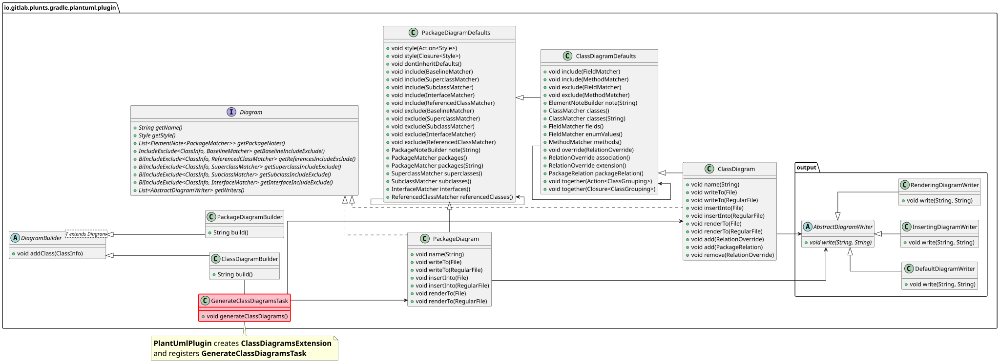
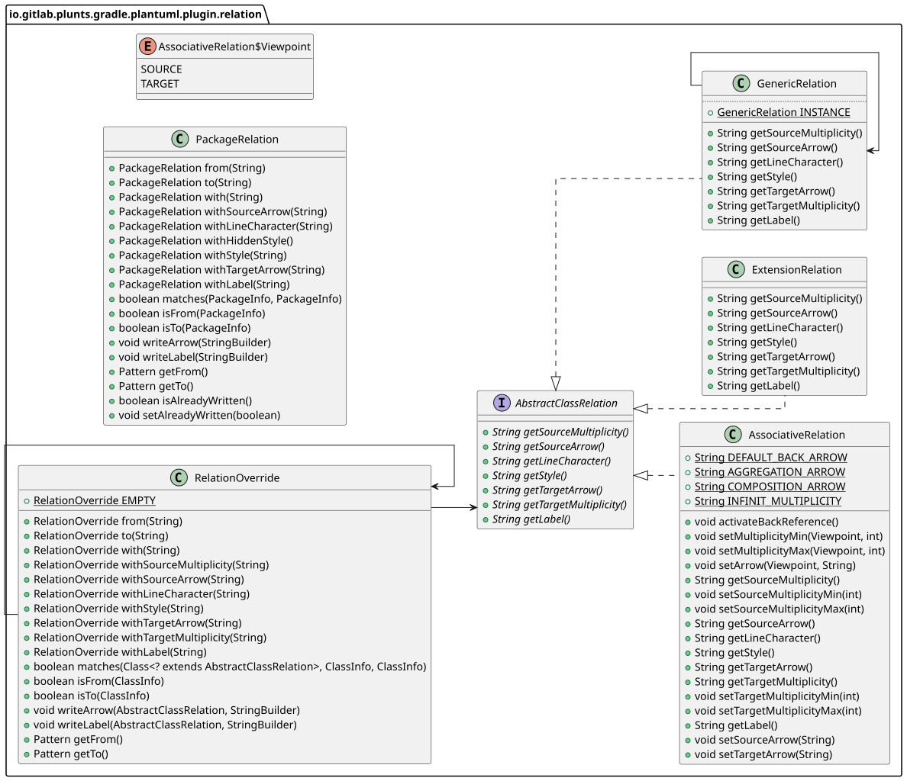
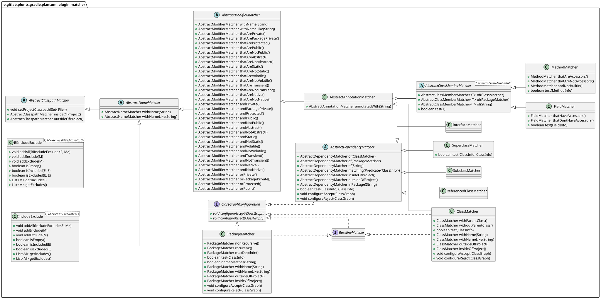

# Class Diagrams of the plantuml-gradle-plugin

The following are diagrams, generated with the plantuml-gradle-plugin
for a better understanding of the architecture of the plugin.
To create the svg diagrams and this file call:

`./gradlew generatePluginDiagrams`

---
  
### plugin-overview.svg

### <a href='plugin-overview.svg'>Show only plugin-overview.svg</a>

---
  
### plugin-relation-overview.svg

### <a href='plugin-relation-overview.svg'>Show only plugin-relation-overview.svg</a>

---
  
### plugin-matcher-overview.svg

### <a href='plugin-matcher-overview.svg'>Show only plugin-matcher-overview.svg</a>
