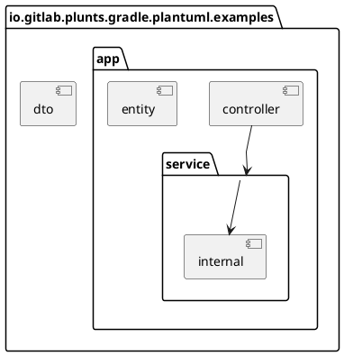
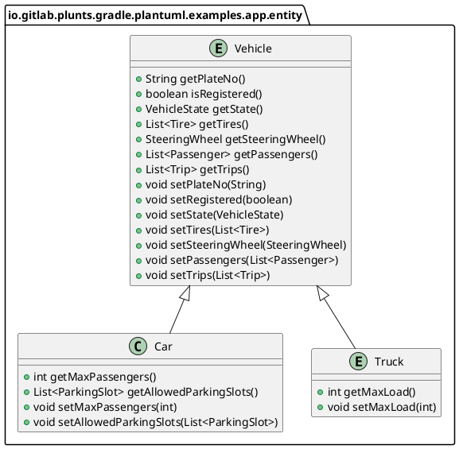
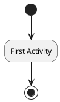

# Example App

This example application shows a variaty of use-cases for the plugin.
Most of the results are written to the subfolder `diagrams`.
They are considered as documented behaviour and therefore checked by the unit tests.
Two diagrams are actually inserted right here:

Here is some completly unrelated diagram which is not overwritten:

